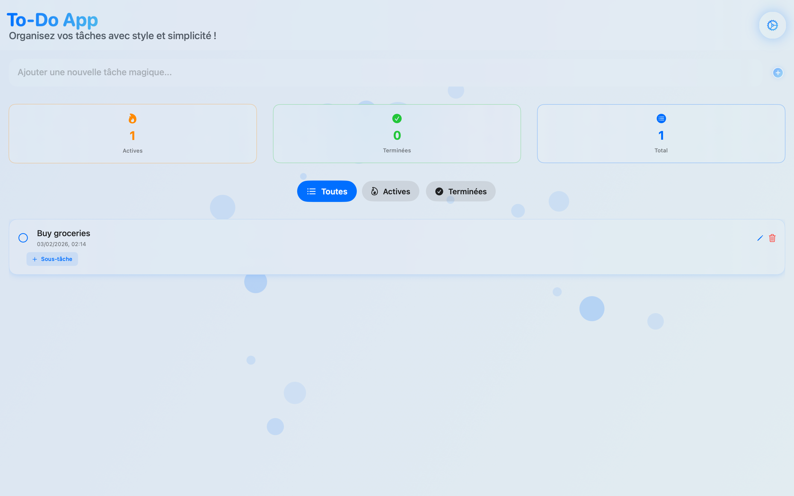
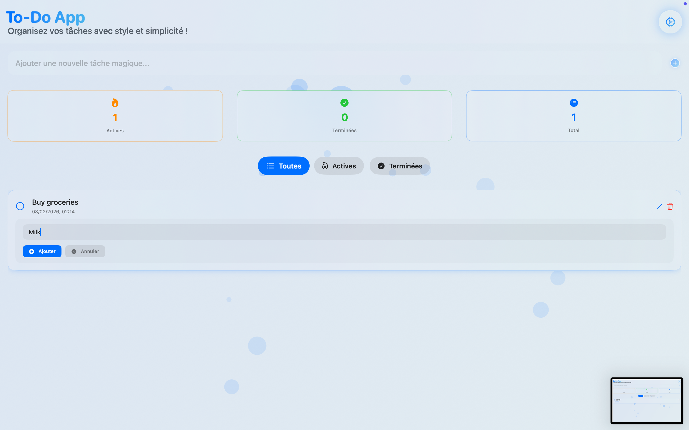
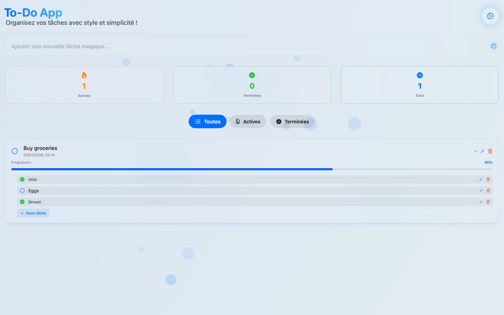
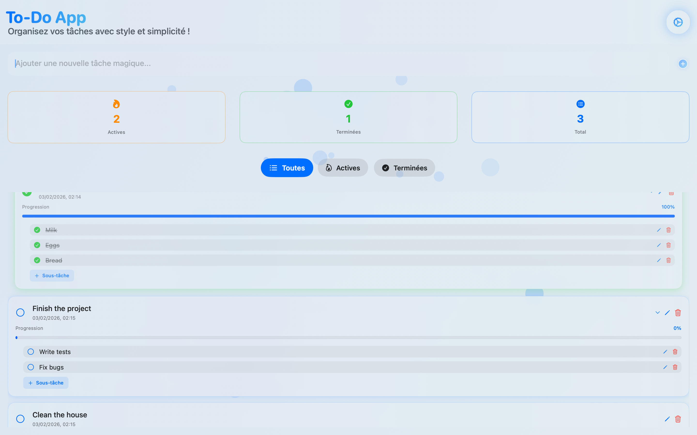
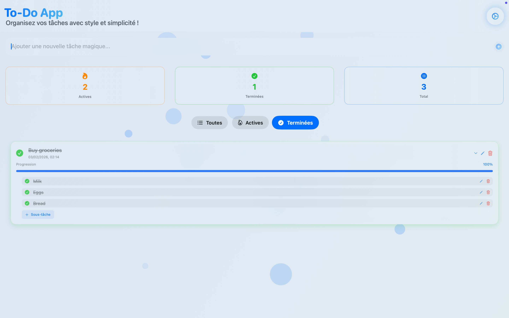
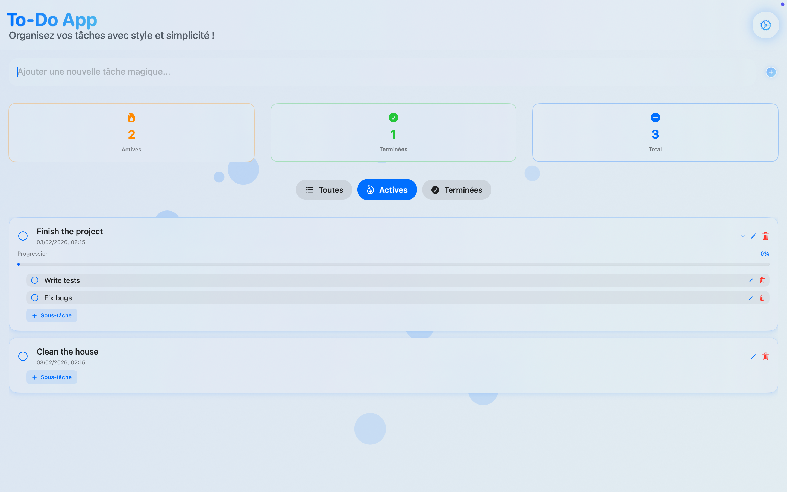
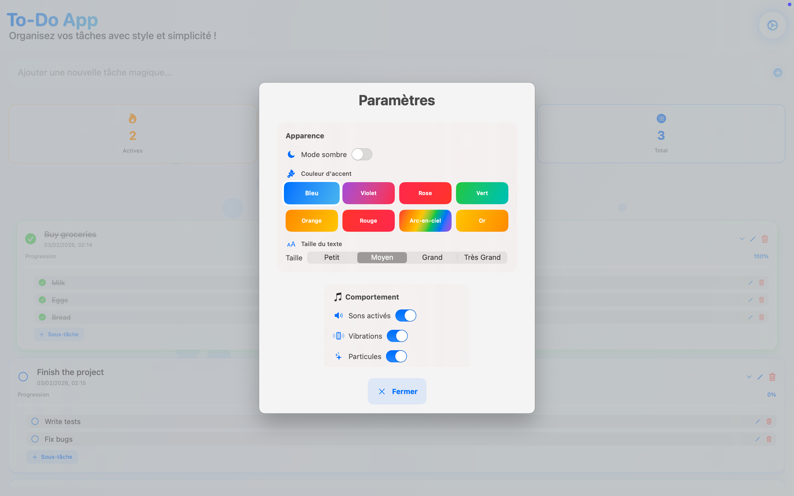
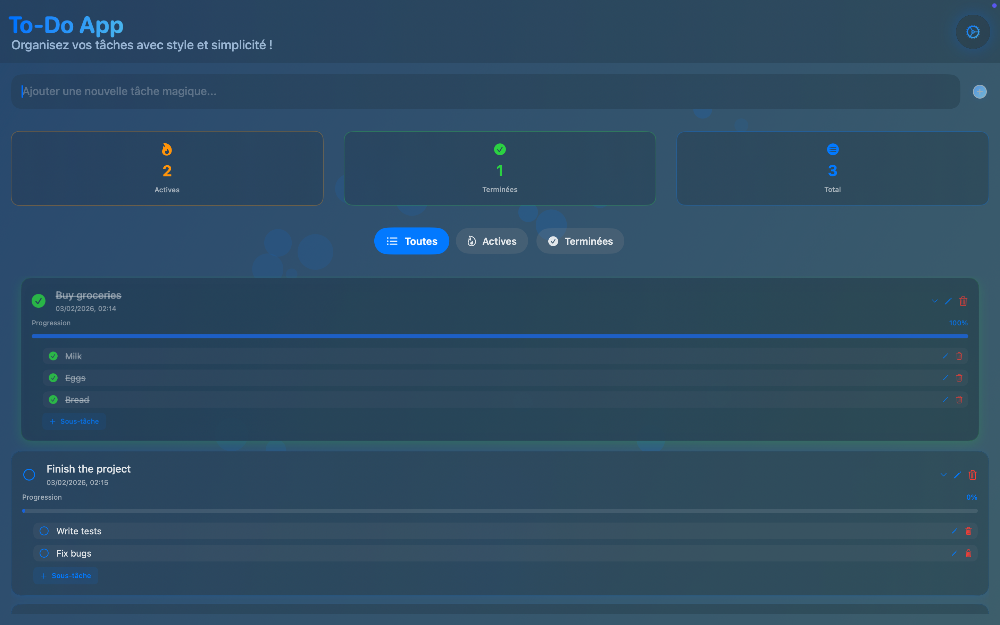

# Todo App en Swift

Une application native macOS/iOS construite entierement avec **SwiftUI** et **CoreData**. Sous-taches, drag-and-drop, themes personnalisables, animations de particules et retours sonores/haptiques — le tout sans aucune dependance externe.


> **[Read in English](README.md)**

---

## Fonctionnalites

```
+---------------------------------------------+
|             Todo App                  [gear]|
+---------------------------------------------+
|  [ Entrer une nouvelle tache... ][+ Ajouter]|
+---------------------------------------------+
|  Actives: 3     Terminees: 5     Total: 8   |
+---------------------------------------------+
|  [Tout]  [Actives]  [Terminees]             |
+---------------------------------------------+
|                                             |
|  [x] Acheter des courses        [edit][del] |
|      |-- [x] Lait                           |
|      |-- [ ] Oeufs                          |
|      |-- [x] Pain                           |
|      Progression: =========>     66%        |
|                                             |
|  [ ] Finir le projet            [edit][del] |
|      |-- [ ] Ecrire les tests               |
|      |-- [ ] Corriger les bugs              |
|      Progression: =>                0%      |
|                                             |
|  [x] Nettoyer la maison         [edit][del] |
|                                             |
+---------------------------------------------+
```

### Gestion des taches
- Creer, modifier et supprimer des taches
- Marquer les taches comme terminees avec une case a cocher animee
- Reordonnancement par drag-and-drop avec ordre persistant
- Filtrer les taches : **Tout** / **Actives** / **Terminees**
- Statistiques en temps reel (actives, terminees, total)

### Sous-taches
- Ajouter des sous-taches a n'importe quelle tache
- Barre de progression du pourcentage de completion
- Listes de sous-taches repliables
- Reordonnancement drag-and-drop independant par tache

### Personnalisation (Panneau de reglages)

```
+------------------------------------------+
|           Reglages                 [X]   |
+------------------------------------------+
|                                          |
|  Apparence                               |
|  +------------------------------------+  |
|  | Mode sombre          [OUI/non]     |  |
|  |                                    |  |
|  | Couleur d'accentuation             |  |
|  | [bleu] [violet] [rose] [vert ]     |  |
|  | [orange] [rouge] [arc-c.] [dore ]  |  |
|  |                                    |  |
|  | Taille de police                   |  |
|  | [P] [M] [G] [TG]                   |  |
|  +------------------------------------+  |
|                                          |
|  Comportement                            |
|  +------------------------------------+  |
|  | Effets sonores        [OUI/non]    |  |
|  | Retour haptique       [OUI/non]    |  |
|  | Particules            [OUI/non]    |  |
|  | Celebrations          [OUI/non]    |  |
|  +------------------------------------+  |
|                                          |
|  Avance                                  |
|  +------------------------------------+  |
|  | Vitesse anim.    0.5x ====> 3.0x   |  |
|  | Nb. particules   5 =========> 50   |  |
|  | [ Reinitialiser par defaut       ] |  |
|  +------------------------------------+  |
|                                          |
+------------------------------------------+
```

### Effets visuels
- Fond anime avec particules
- Overlay de celebration avec confettis a la completion d'une tache
- Animations spring et bounce dans toute l'interface
- Fonds en degrade et couleurs d'accentuation dynamiques

### Retours utilisateur
- Effets sonores — Glass (ajout), Funk (suppression), Pop (reordonnancement)
- Retour haptique sur les interactions
- Animations visuelles a chaque changement d'etat

---

## Stack technique

```
+---------------------------------------------------+
|                    SwiftUI                        |
|            (Vues, Animations, Etat)               |
+------------------------+--------------------------+
|                        |                          |
|     CoreData           |       Combine            |
|  (Persistance)         |  (@Published, reactif)   |
+------------------------+--------------------------+
|                        |                          |
|  UniformTypeIdentifiers|      SF Symbols          |
|   (Drag & Drop)        |    (Toutes les icones)   |
+------------------------+--------------------------+
```

**Zero dependance externe** — construit uniquement avec les frameworks Apple.

---

## Structure du projet

```
TodoApp/
│
├── TodoAppApp.swift              # Point d'entree & injection CoreData
│
├── Vues/
│   ├── ContentView.swift         # Vue principale — liste, filtres, stats
│   ├── TodoRowView.swift         # Ligne de tache + sous-taches
│   └── SettingsView.swift        # Panneau de reglages
│
├── Modeles/
│   ├── Models.swift              # FilterType, AccentColor, FontSize, AppSettings
│   ├── CoreDataModels.swift      # Extensions CoreData & gestionnaire CRUD
│   └── Persistence.swift         # PersistenceController (singleton)
│
├── Animations/
│   ├── AnimationComponents.swift     # Particules & effets de celebration
│   ├── CelebrationManager.swift      # Etat global de celebration
│   └── ParticleBackgroundView.swift  # Wrapper particules en arriere-plan
│
└── Donnees/
    └── TodoApp.xcdatamodeld/     # Schema CoreData
```

---

## Architecture

```
┌─────────────────────────────────────────────────────────┐
│                     Couche UI                           │
│                                                         │
│  ┌──────────────┐  ┌──────────────┐  ┌──────────────┐   │
│  │ ContentView  │  │ TodoRowView  │  │ SettingsView │   │
│  │              │  │              │  │              │   │
│  │ - Liste      │  │ - Checkbox   │  │ - Mode sombre│   │
│  │ - Filtres    │  │ - Sous-taches│  │ - Couleurs   │   │
│  │ - Stats      │  │ - Progression│  │ - Sons       │   │
│  │ - Ajout      │  │ - Drag/Drop  │  │ - Particules │   │
│  └──────┬───────┘  └──────┬───────┘  └──────┬───────┘   │
│         │                 │                  │          │
└─────────┼─────────────────┼──────────────────┼──────────┘
          │                 │                  │
┌─────────┼─────────────────┼──────────────────┼──────────┐
│         ▼                 ▼                  ▼          │
│                  Couche d'etat                          │
│                                                         │
│  @FetchRequest ←──── CoreData ────→ @Published          │
│  (requetes reactives) (SQLite)      (AppSettings)       │
│                                                         │
└─────────────────────────┬───────────────────────────────┘
                          │
┌─────────────────────────┼───────────────────────────────┐
│                         ▼                               │
│                Couche de donnees                        │
│                                                         │
│  ┌─────────────────┐     ┌──────────────────┐           │
│  │    TodoItem     │────►│   SubtaskItem    │           │
│  │                 │ 1:N │                  │           │
│  │ - text          │     │ - text           │           │
│  │ - isCompleted   │     │ - isCompleted    │           │
│  │ - timestamp     │     │ - timestamp      │           │
│  │ - sortOrder     │     │ - sortOrder      │           │
│  └─────────────────┘     └──────────────────┘           │
│                                                         │
│           PersistenceController (singleton)              │
└─────────────────────────────────────────────────────────┘
```

### Flux de gestion d'etat

```
Action utilisateur ──► @State (UI local) ──► viewContext.save() ──► CoreData
                                                                     │
                                                     @FetchRequest ◄─┘
                                                           │
                                                      Vue SwiftUI
                                                   (rafraichissement
                                                     automatique)
```

---

## Prerequis

| Prerequis | Version minimale |
|-----------|-----------------|
| Xcode     | 15.0+           |
| Swift     | 5.9+            |
| macOS     | 14.0+ (Sonoma)  |
| iOS       | 17.0+           |

---

## Demarrage rapide

### 1. Cloner le depot

```bash
git clone https://github.com/moimat2345/Todo-app-in-swift.git
cd Todo-app-in-swift
```

### 2. Ouvrir dans Xcode

```bash
open TodoApp/TodoApp.xcodeproj
```

### 3. Compiler et lancer

```
Xcode ──► Choisir la cible (Simulateur / Appareil) ──► Cmd + R ──► C'est pret
```

> Aucune configuration supplementaire — pas de pods, pas de packages, pas de cles API.

---

## Modele CoreData

```
┌─────────────────────┐          ┌─────────────────────┐
│     TodoItem        │          │    SubtaskItem      │
├─────────────────────┤          ├─────────────────────┤
│ text        String  │          │ text        String  │
│ isCompleted Bool    │ 1    N   │ isCompleted Bool    │
│ timestamp   Date    │─────────►│ timestamp   Date    │
│ sortOrder   Int32   │ subtasks │ sortOrder   Int32   │
│                     │          │                     │
│ + parent    (self)  │          │ + parentTask        │
│ + children  (self)  │          │   (→ TodoItem)      │
└─────────────────────┘          └─────────────────────┘
```

---

## Captures d'ecran

### Vue principale


### Ajout d'une sous-tache


### Sous-taches avec barre de progression


### Vue complete avec plusieurs taches


### Filtre — Taches terminees


### Filtre — Taches actives


### Panneau de reglages


### Mode sombre


---

## Licence

Ce projet est disponible sous la [licence MIT](LICENSE).
